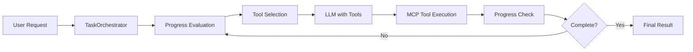

# MCP Task Orchestrator

An intelligent task automation system that combines Large Language Models (LLMs) with Model Context Protocol (MCP) tools for complex web-based task execution.

## 🎯 Overview

This project demonstrates a clean architecture pattern for building AI agents that can execute complex, multi-step tasks by combining:
- **OpenAI API** for intelligent reasoning and planning
- **FastMCP** for connecting to MCP servers
- **Playwright MCP Server** for web browser automation
- **Smart orchestration** with progress evaluation and automatic tool execution

## 🏗️ Architecture

```
┌─────────────┐    ┌──────────────────┐    ┌─────────────┐
│   main.py   │───▶│ TaskOrchestrator │◀───│ MessageSystem│
└─────────────┘    └──────────────────┘    └─────────────┘
                           │
                    ┌──────┴──────┐
                    ▼             ▼
              ┌───────────┐  ┌─────────────┐
              │ LLMClient │  │  MCPClient  │
              └───────────┘  └─────────────┘
                    │              │
                    ▼              ▼
            ┌─────────────┐  ┌─────────────┐
            │ OpenAI API  │  │Playwright   │
            │             │  │MCP Server   │
            └─────────────┘  └─────────────┘
```

## ✨ Features

- **Smart Task Orchestration**: Automatically breaks down complex tasks into manageable steps
- **Progress Evaluation**: JSON-based progress assessment with completion detection  
- **Automatic Tool Calling**: Seamless integration between LLM reasoning and MCP tool execution
- **Error Resilience**: Retry mechanisms and graceful failure recovery
- **Clean Architecture**: Separation of concerns with well-defined interfaces
- **Async Support**: Full async/await support for high performance

## 🚀 Quick Start

### Prerequisites

- Python 3.12+
- [uv](https://github.com/astral-sh/uv) package manager
- OpenAI API key (or compatible API)
- Running Playwright MCP server on `localhost:8931`

### Installation

```bash
# Clone the repository
git clone <repository-url>
cd mcp-task-orchestrator

# Install dependencies
uv install

npx @playwright/mcp@latest --port 8931
```

### Configuration

Set up your environment variables:

```bash
# Required
export OPENAI_API_KEY="your-api-key-here"

# Optional - for custom OpenAI-compatible APIs  
export OPENAI_BASE_URL="https://api.your-provider.com/v1"
```

### Run the Demo

```bash
uv run python main.py
```

The demo will execute a complex task that:
1. Opens Google.com
2. Searches for Nvidia's latest earnings call transcript
3. Reads and analyzes the content
4. Provides a summary of the Q&A session

## 📁 Project Structure

```
src/
├── __init__.py
├── task_orchestrator.py    # Main orchestration logic
├── llm_client.py          # OpenAI API integration  
├── mcp_client.py          # MCP server communication
└── message_system.py      # Conversation management

main.py                    # Demo application
pyproject.toml            # Project configuration
CLAUDE.md                 # Development guidelines
```

## 🔧 Core Components

### TaskOrchestrator

The brain of the system that manages task execution:
- Evaluates progress with JSON-based assessment
- Coordinates between LLM and MCP clients
- Implements iterative execution with smart stopping conditions
- Handles up to 25 iterations with progress tracking

### LLMClient

OpenAI API integration with advanced features:
- Automatic tool calling with retry mechanisms
- Support for multiple OpenAI-compatible APIs
- Single-cycle tool execution with follow-up processing
- Configurable model selection

### MCPClient  

FastMCP wrapper for MCP server communication:
- Async context manager for clean resource handling
- Tool discovery and execution capabilities
- Direct integration with Playwright MCP server
- Connection testing and health checks

### MessageSystem

Centralized conversation management:
- OpenAI format conversion and compatibility
- Tool call tracking and result management
- Conversation history and summaries
- Thread-safe message handling

## 🛠️ Available Tools

The system connects to a Playwright MCP server providing 21+ browser automation tools:

| Category | Tools | Description |
|----------|-------|-------------|
| **Navigation** | `browser_navigate`, `browser_go_back`, `browser_refresh` | Page navigation |
| **Interaction** | `browser_click`, `browser_type`, `browser_fill_form` | User interactions |
| **Content** | `browser_take_screenshot`, `browser_snapshot`, `browser_extract` | Content capture |
| **Automation** | `browser_wait_for`, `browser_evaluate`, `browser_file_upload` | Advanced automation |

## 🔄 Task Flow



## 📊 Example Task Execution

```python
user_request = """
1. Open google.com and search for the latest earnings call transcript for Nvidia
2. Try to find the latest earnings call transcript  
3. Read the earnings call transcript
4. Give me a summary of the earnings call transcript QA session
"""

# The orchestrator handles the complexity:
result = await orchestrator.execute_task(user_request)
```

The system will:
- ✅ Navigate to Google
- ✅ Perform search queries
- ✅ Click on relevant results
- ✅ Extract and analyze content
- ✅ Generate intelligent summaries
- ✅ Provide progress updates at each step

## 🧪 Development

### Code Style

```bash
# Format code
uv run black .

# Check linting  
uv run ruff check .

# Fix linting issues
uv run ruff check --fix .
```

### Testing

```bash
# Run tests
uv run pytest
```

### Development Guidelines

- Follow async/await patterns for all I/O operations
- Use type hints and comprehensive docstrings
- Implement proper error handling with retries
- Follow the clean architecture principles
- Test MCP connectivity before running orchestrator

## 🔒 Environment Variables

### Required
- `OPENAI_API_KEY`: Your OpenAI API key for LLM access

### Optional  
- `OPENAI_BASE_URL`: Custom API endpoint for OpenAI-compatible services (e.g., DeepSeek, Together AI, etc.)

## 📚 Dependencies

| Package | Version | Purpose |
|---------|---------|---------|
| `openai` | ≥1.0.0 | LLM API integration |
| `fastmcp` | ≥2.0.0 | MCP framework |
| `pydantic` | ≥2.0.0 | Data validation |
| `aiohttp` | ≥3.8.0 | Async HTTP operations |
| `rich` | ≥13.0.0 | Terminal output enhancement |
| `python-dotenv` | ≥1.0.0 | Environment variable management |

## 🤝 Contributing

1. Fork the repository
2. Create a feature branch
3. Make your changes following the code style guidelines
4. Add tests for new functionality
5. Submit a pull request

## 📄 License

This project is open source and available under the [MIT License](LICENSE).

## 🙏 Acknowledgments

- [FastMCP](https://github.com/jlowin/fastmcp) for the excellent MCP framework
- [OpenAI](https://openai.com) for the GPT API
- [Playwright](https://playwright.dev/) for web automation capabilities

---

**Built with ❤️ for the Model Context Protocol community**