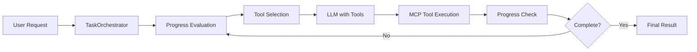

# MCP Task Orchestrator

An intelligent task automation system that combines Large Language Models (LLMs) with Model Context Protocol (MCP) tools for complex web-based task execution.

## 🎯 Overview

This project demonstrates a clean architecture pattern for building AI agents that can execute complex, multi-step tasks by combining:
- **Multiple LLM APIs** (OpenAI, Google Gemini, etc.) for intelligent reasoning and planning
- **FastMCP** for connecting to MCP servers
- **Playwright MCP Server** for web browser automation
- **Smart orchestration** with progress evaluation and automatic tool execution
- **Interactive Terminal Interface** with rich UI, model switching, and task interruption
- **Modular Architecture** with BaseOrchestrator, TaskOrchestrator, and InteractiveOrchestrator

## 🏗️ Architecture

```
┌─────────────────┐    ┌──────────────────┐    ┌─────────────┐
│ TerminalInterface│    │ BaseOrchestrator │    │ MessageSystem│
│   (interaction.py)│    │  (common logic)  │    └─────────────┘
└─────────────────┘    └──────────────────┘           ▲
         │                       │                   │
         ▼                       ▼                   │
┌─────────────────┐    ┌──────────────────┐          │
│TaskOrchestrator │    │InteractiveOrch. │          │
│   (main.py)     │    │  (interactive)   │          │
└─────────────────┘    └──────────────────┘          │
         │                       │                   │
         └───────────────────────┼───────────────────┘
                                 ▼
                    ┌────────────┴────────────┐
                    ▼                         ▼
              ┌───────────┐            ┌─────────────┐
              │ LLMClient │            │  MCPClient  │
              └───────────┘            └─────────────┘
                    │                         │
                    ▼                         ▼
            ┌─────────────┐            ┌─────────────┐
            │ Multiple    │            │Playwright   │
            │ LLM APIs    │            │MCP Server   │
            │(OpenAI, etc)│            └─────────────┘
            └─────────────┘
```

## ✨ Features

### Core Features
- **Smart Task Orchestration**: Automatically breaks down complex tasks into manageable steps
- **Progress Evaluation**: JSON-based progress assessment with completion detection
- **Automatic Tool Calling**: Seamless integration between LLM reasoning and MCP tool execution
- **Multiple LLM Support**: Compatible with OpenAI, Google Gemini, and other OpenAI-compatible APIs
- **Error Resilience**: Retry mechanisms and graceful failure recovery
- **Clean Architecture**: Separation of concerns with well-defined interfaces
- **Async Support**: Full async/await support for high performance

### Terminal Interface Features
- **Rich Interactive UI**: Professional terminal interface with colored output and progress indicators
- **Dynamic Model Discovery**: Automatically fetches and displays all available models from LLM APIs (320+ models)
- **Smart Model Switching**: Switch between different models during runtime (`/model gpt-4o`)
- **Task Interruption**: Press Ctrl+C or ESC to immediately stop running tasks
- **Conversation Management**: Clear conversation history (`/clear`) and automatic reset for new tasks
- **Graceful Error Handling**: Robust error recovery with MCP server reconnection
- **Command System**: Full command-line interface with `/model`, `/clear`, `/quit` commands

## 🚀 Quick Start

### Prerequisites

- Python 3.12+
- [uv](https://github.com/astral-sh/uv) package manager
- OpenAI API key (or compatible API)
- Running Playwright MCP server on `localhost:8931`

### Installation

```bash
# Clone the repository
git clone <repository-url>
cd mcp-task-orchestrator

# Install dependencies
uv install

npx @playwright/mcp@latest --port 8931
```

### Configuration

Set up your environment variables:

```bash
# Required
export OPENAI_API_KEY="your-api-key-here"

# Optional - for custom OpenAI-compatible APIs  
export OPENAI_BASE_URL="https://api.your-provider.com/v1"
```

### Run the Applications

#### Interactive Terminal Interface (Recommended)
```bash
uv run python interaction.py
```

The interactive terminal provides:
- Rich UI with colored output and progress indicators
- Dynamic model switching (`/model gpt-4o`)
- Task interruption with Ctrl+C
- Conversation management (`/clear`)
- Automatic error recovery and reconnection

#### Demo Script
```bash
uv run python main.py
```

The demo script executes a predefined complex task:
1. Opens Google.com
2. Searches for Nvidia's latest earnings call transcript
3. Reads and analyzes the content
4. Provides a summary of the Q&A session

## 📁 Project Structure

```
src/
├── __init__.py
├── llm_client.py              # Multi-API LLM integration (OpenAI, Gemini, etc.)
├── mcp_client.py              # FastMCP server communication
├── message_system.py          # Conversation management and history
└── orchestrator/
    ├── __init__.py
    ├── base_orchestrator.py   # Common orchestration logic
    ├── task_orchestrator.py   # Batch processing orchestrator
    └── interactive_orchestrator.py  # Interactive terminal orchestrator

interaction.py              # Rich terminal interface with model switching
main.py                     # Demo application with predefined tasks
pyproject.toml             # Modern Python packaging configuration
CLAUDE.md                  # Development guidelines and project details
README.md                  # This file
```

## 🔧 Core Components

### TerminalInterface (`interaction.py`)

Sophisticated terminal interface for interactive task orchestration:
- **Rich UI**: Professional interface with colored output, tables, and progress indicators
- **Dynamic Model Management**: Lists 320+ available models, switches models on-the-fly
- **Smart Task Control**: Interrupt running tasks with Ctrl+C, automatic conversation reset
- **Command System**: `/model`, `/clear`, `/quit` commands with intelligent handling
- **Error Recovery**: Automatic MCP server reconnection while preserving conversation memory
- **Graceful Shutdown**: Clean resource cleanup and session management

### BaseOrchestrator (`src/orchestrator/base_orchestrator.py`)

Foundation orchestrator containing all common logic:
- **Progress Evaluation**: JSON-based assessment with intelligent completion detection
- **Tool Preparation**: Automatic MCP tool discovery and OpenAI format conversion
- **Iteration Management**: Smart execution loops with configurable stopping conditions
- **Error Handling**: Robust fallback mechanisms for various API response formats
- **Message Management**: Integration with MessageSystem for conversation tracking

### TaskOrchestrator (`src/orchestrator/task_orchestrator.py`)

Batch processing orchestrator for automated workflows:
- **Simple Execution**: Straightforward task completion without user interaction
- **Minimal Overhead**: Lightweight implementation for scripted environments
- **Clean Architecture**: Inherits from BaseOrchestrator with specialized behavior
- **Demo Integration**: Used in `main.py` for predefined task execution

### InteractiveOrchestrator (`src/orchestrator/interactive_orchestrator.py`)

Interactive orchestrator with user control capabilities:
- **Interrupt Support**: Async cancellation handling for responsive UI
- **Progress Evaluation**: User-controlled task assessment with interruption points
- **Terminal Integration**: Specialized for rich terminal interface use cases
- **Memory Preservation**: Maintains conversation context during interruptions

### LLMClient (`src/llm_client.py`)

Multi-API LLM integration with advanced features:
- **Multiple Providers**: Support for OpenAI, Google Gemini, and compatible APIs
- **Automatic Tool Calling**: Seamless function calling with retry mechanisms
- **Single-Cycle Execution**: Efficient tool execution with follow-up processing
- **Model Flexibility**: Dynamic model switching and configuration
- **Error Resilience**: Robust handling of API failures and format variations

### MCPClient (`src/mcp_client.py`)

FastMCP wrapper for MCP server communication:
- **Async Context Management**: Clean resource handling with automatic cleanup
- **Tool Discovery**: Dynamic tool enumeration and capability assessment
- **Health Monitoring**: Connection testing and automatic reconnection
- **Playwright Integration**: Direct compatibility with Playwright MCP server
- **Performance Optimized**: Efficient tool execution with connection pooling

### MessageSystem (`src/message_system.py`)

Centralized conversation management system:
- **Multi-Format Support**: OpenAI and custom format compatibility
- **Tool Call Tracking**: Complete request/response cycle management
- **Conversation History**: Persistent context with intelligent summarization
- **Thread Safety**: Concurrent access protection for multi-threaded environments
- **Memory Management**: Efficient conversation pruning and cleanup

## 🛠️ Available Tools

The system connects to a Playwright MCP server providing 21+ browser automation tools:

| Category | Tools | Description |
|----------|-------|-------------|
| **Navigation** | `browser_navigate`, `browser_go_back`, `browser_refresh` | Page navigation |
| **Interaction** | `browser_click`, `browser_type`, `browser_fill_form` | User interactions |
| **Content** | `browser_take_screenshot`, `browser_snapshot`, `browser_extract` | Content capture |
| **Automation** | `browser_wait_for`, `browser_evaluate`, `browser_file_upload` | Advanced automation |

## 🔄 Task Flow



## 📊 Example Task Execution

```python
user_request = """
1. Open google.com and search for the latest earnings call transcript for Nvidia
2. Try to find the latest earnings call transcript  
3. Read the earnings call transcript
4. Give me a summary of the earnings call transcript QA session
"""

# The orchestrator handles the complexity:
result = await orchestrator.execute_task(user_request)
```

The system will:
- ✅ Navigate to Google
- ✅ Perform search queries
- ✅ Click on relevant results
- ✅ Extract and analyze content
- ✅ Generate intelligent summaries
- ✅ Provide progress updates at each step

## 🧪 Development

### Code Style

```bash
# Format code
uv run black .

# Check linting  
uv run ruff check .

# Fix linting issues
uv run ruff check --fix .
```

### Testing

```bash
# Run tests
uv run pytest
```

### Development Guidelines

- Follow async/await patterns for all I/O operations
- Use type hints and comprehensive docstrings
- Implement proper error handling with retries
- Follow the clean architecture principles
- Test MCP connectivity before running orchestrator

## 🔒 Environment Variables

### Required
- `OPENAI_API_KEY`: Your OpenAI API key for LLM access

### Optional  
- `OPENAI_BASE_URL`: Custom API endpoint for OpenAI-compatible services (e.g., DeepSeek, Together AI, etc.)

## 📚 Dependencies

| Package | Version | Purpose |
|---------|---------|---------|
| `openai` | ≥1.0.0 | Multi-API LLM integration (OpenAI, Gemini, etc.) |
| `fastmcp` | ≥2.0.0 | MCP framework for tool communication |
| `pydantic` | ≥2.0.0 | Data validation and type checking |
| `rich` | ≥13.0.0 | Rich terminal UI and formatting |
| `aiohttp` | ≥3.8.0 | Async HTTP operations |
| `markdown` | ≥3.5.0 | Markdown processing and rendering |
| `python-dotenv` | ≥1.0.0 | Environment variable management |
| `asyncio` | ≥3.4.3 | Async programming support |

## 🤝 Contributing

1. Fork the repository
2. Create a feature branch
3. Make your changes following the code style guidelines
4. Add tests for new functionality
5. Submit a pull request

## 📄 License

This project is open source and available under the [MIT License](LICENSE).

## 🙏 Acknowledgments

- [FastMCP](https://github.com/jlowin/fastmcp) for the excellent MCP framework
- [OpenAI](https://openai.com) for the GPT API
- [Playwright](https://playwright.dev/) for web automation capabilities

---

**Built with ❤️ for the Model Context Protocol community**